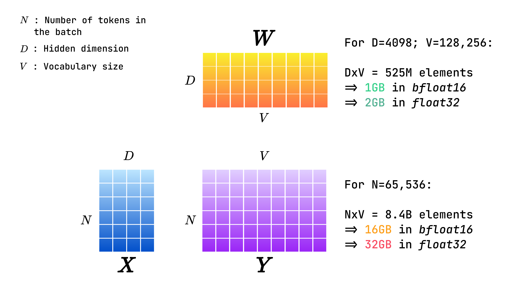
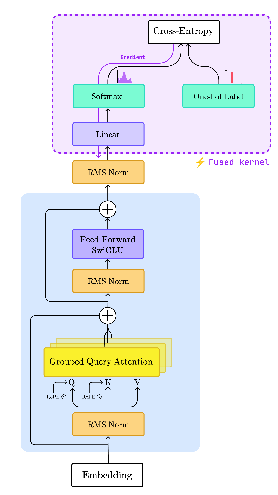
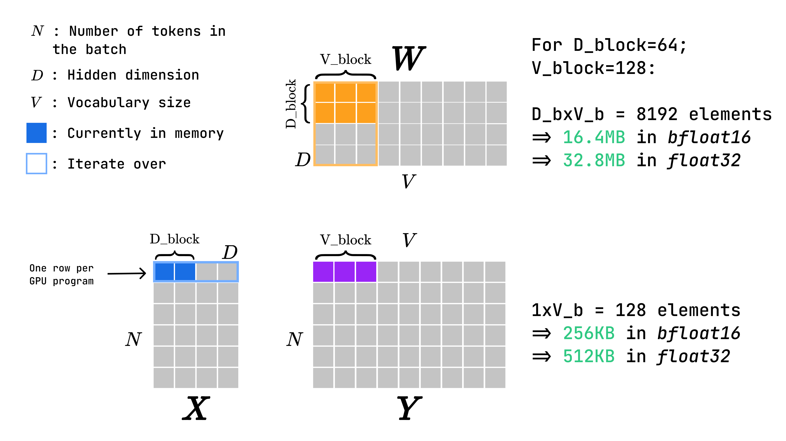
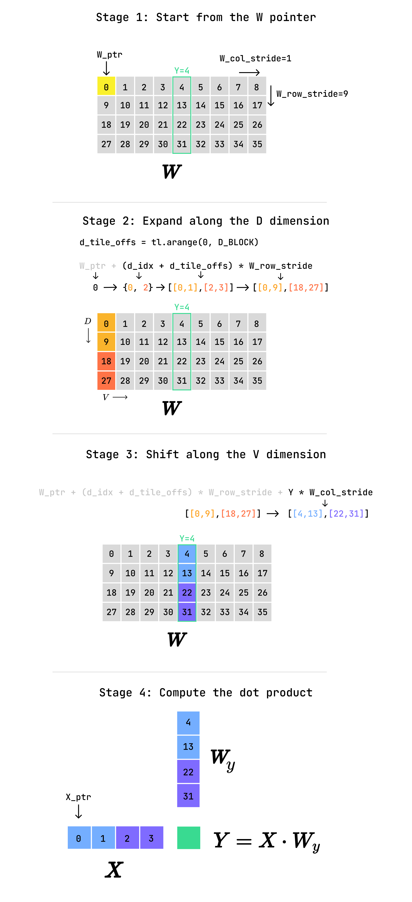
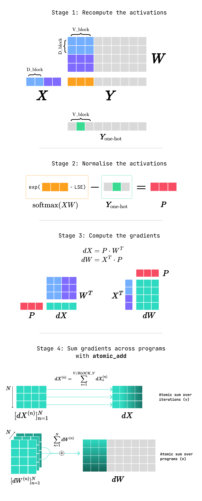

import MemoryCalculator from '../../../components/widgets/MemoryCalculator';
import BarChart from '../../../components/charts/BarChart.astro';
import { PRESETS, computeMemoryModel, formatBytes } from '../../../lib/memory-model';

> Why your final LLM layer is OOMing and how to fix it with a custom Triton kernel.

If you've ever trained or fine-tuned an LLM, you've likely hit a wall at the very last step: the **Cross-Entropy Loss**.

The culprit is the **logit bottleneck**. To predict the next token, we project a hidden state into a massive vocabulary space. For Llama 3 (128,256 tokens), the weight matrix alone is over **525 million parameters**. While that's only ~1GB in `bfloat16`, the intermediate logit tensor is the real killer: for large batches, it can easily exceed **80GB** of VRAM just to compute a single scalar loss.

Optimising this layer is how libraries like **Unsloth** and **Liger-Kernel** achieve such massive memory reductions. In this article, we'll build a fused `Linear + Cross Entropy` kernel from scratch in Triton. We will derive the math and implement a tiled forward and backward pass that slashes peak memory usage by **84%**.

> **Note on Performance:** This implementation is primarily **educational**. We prioritise mathematical clarity and readable Triton code by using global atomic operations. While it solves the memory bottleneck, matching production-grade speeds would require significantly more complex implementations which are out of scope for this article.

_This post is part of my Triton series. We'll be using concepts like [tiling](/articles/matmul) and [online softmax](/articles/softmax) that we've covered previously. If those sound unfamiliar, I recommend catching up there first, starting with [vector addition](/articles/vector-addition)!_

# The Logit Bottleneck

To get us started, let's put some more numbers on the logit bottleneck. We consider an input matrix `X` with shape `[NxD]`, a weight matrix `W` with shape `[DxV]` and a logit matrix `Y=X@W` with shape `[NxV]`. In the context of an LLM, `N` would be the sequence length multiplied by the batch size, `D` the size of the hidden state and `V` the vocabulary size.
For a Llama3 8B model, we would have a context window of 8192 tokens, a hidden state with 4096 dimensions and a vocabulary size of 128,256 tokens. Using a modest batch size of 8, we get `N = 8192x8 = 65,536`.
This results in the `Y` matrix having shape `[NxV]=[65,536x128,256]`, or roughly **8.4 billion** elements. In `bfloat16`, this would take up **`16.8GB`** of memory. However, if we follow best practices and use `float32` for the loss calculation to ensure numerical stability, the requirements double to **`33.6GB`**.
To put this number in perspective, we would also need around `16GB` of memory to hold the weights of Llama3 8B in memory in `bfloat16`. One most GPUs, this leaves no space for the massive overhead of the optimiser states (e.g. `Adam`'s moments) and other activations, resulting in the infamous PyTorch OOM error.


_Representation of the input, weight and logit matrices along with their memory footprint. (All illustrations and animations in this article were made by the author)_

Generally, this problem is dealt with by using:

- **Gradient accumulation:** Use a smaller batch size and accumulate gradients over multiple batches between each optimiser step, emulating a larger batch size while holding less data in memory.
- **Activation checkpointing:** PyTorch stores all intermediate activations for reuse in the backward pass, checkpointing clears these activations and recomputes them on-the-fly during the backward pass. This leads to large memory savings but increases training time since the number of required forward passes is doubled.
- **Micro-batching the loss:** Instead of computing the loss over the `N` dimension at once, we can slice it and accumulate the loss over smaller chunks with size `n < N`. Now, we only hold a slice of size `[n, V]` in memory at a time.
- **Mixed precision training:** Using half precision during training provides 2x memory reduction and significant speedups on Tensor Cores.

While these solutions seem attractive, they all have significant drawbacks: gradient accumulation and activation checkpointing slow down training, mixed precision can be unstable and micro-batching requires (slow) PyTorch level iteration and even though `n` is chosen to be smaller than `N`, the vocabulary size remains huge in comparison.
More importantly, these solutions do not address the problem we have dealt with repeatedly throughout this series: **data movement**. Indeed, we are still wasting time by writing billions of logits to VRAM only to read them back milliseconds later.

## The Kernel Solution

As we'll see in a minute, the forward and backward pass of the cross-entropy loss involve dot products, matrix multiplication and a softmax. As we learned in this series, these are all operations that can be tiled efficiently. In other words, we can perform them iteratively while only holding a small piece of the inputs in memory at any time.
Furthermore, cross-entropy is generally preceded by a matrix multiplication: the linear projection from the hidden state into the vocabulary space. This is a great opportunity for **operator fusion**: fusing multiple operation within a single kernel, resulting in large speedups and potential memory gains.
In the following sections, we'll take a look at how to derive and efficiently fuse the forward and backward passes through a kernel combining a linear layer with cross-entropy.


_Illustration of the Llama3 architecture, the operations handled by the kernel are highlighted in purple._

As mentioned in the last article, Triton kernels do not natively register in PyTorch's `autograd`. Therefore we need to derive the gradient ourselves, a wonderful occasion to brush up on some calculus ;)

# The math behind Fused Linear Cross-Entropy

## Definition and Forward Pass

In this section, we derive the mathematical expression for our Fused Linear Cross-Entropy layer to see how it naturally lends itself to tiling.

For two discrete probability distributions `p` and `q`, cross-entropy is defined as:
$$
H(p,q) = - \sum_{x \in \mathcal{X}} p(x) \log q(x)
$$
In our context, `p` is the **one-hot vector** representing the target token, while `q` is the **model's distribution** over the vocabulary. We obtain `q` by applying a softmax to the logits `l`, themselves the outputs of the preceding linear layer.

Since `p` is positive for a single target token `y`, the summation collapses. We can then substitute the numerically stable softmax (as discussed in the [previous article](/articles/softmax)) to derive the final expression:
$$
\begin{align*}
H(p,q) &= -\log q(l_{y}) \\
&= -\log\left( \frac{e^{ l_{y} - \max_{l} }}{\sum_{j}e^{ l_{j} -\max_{l}}} \right) \\
&= \max_{l} -l_{y} + \log\left( \sum_{j}e^{ l_{j} -\max_{l} } \right) \\
&=\max_{l} - \underbrace{  x\cdot w_{y} }_{ \text{target logit} } + \underbrace{ \log\left( \sum_{j} e^{ x \cdot w_{j} -\max_{l}} \right) }_{ \text{LSE} }
\end{align*}
$$
By substituting the logits `l` with the linear layer `x . w`, we see that the forward pass boils down to three primary quantities:

1. The target logit `x . w_y`.
2. The log-sum-exp (LSE) of all dot products.
3. The global maximum logit used for numerical stability.

Thanks to the online softmax algorithm, we can compute these quantities without ever materialising the full vocabulary in memory. Instead of an `O(V)` memory bottleneck, we iterate over the hidden dimension `D` and the vocabulary `V` in small tiles (`D_block` and `V_block`). This transforms the calculation into an `O(1)` register problem.

To parallelise this effectively, we launch one GPU program per row of the input matrix. Each program independently executes the following steps:
1. **Pre-compute the target logit:** Perform a tiled dot product between the current row of `X` and the column of `W` associated with token `Y`.
2. **Online reduction:** Iterate through the hidden and vocabulary blocks to:
	1. Track the running maximum (`m`)
	2. Update the running sum of exponentials (`d`) using the online softmax formula:
$$
d_{\text{new}} = d_{\text{old}} \times e^{ m_{\text{old}} -m_{\text{new}} } + \sum e^{ l_{\text{tile}}-m_{\text{new}} }
$$


_An example of tiled matrix multiplication for a single GPU program processing a row of `X`. The coloured squares represent elements loaded in memory and the coloured outline represent the complete tile that is iterated on. Tiling trades off speed for massive memory gains._

Now that we have a better understanding of the forward pass, let's take a look at the derivation of the backward pass.

## Backward Pass

### Notation

To derive our gradients efficiently, we'll use **Einstein notation** and the **Kronecker delta**.
In Einstein notation, repeated indices are implicitly summed over. For example, a standard matrix multiplication $Y = XW$ simplifies from a verbose summation to a clean index pairing:

$$y_{ij} = \sum_{k} x_{ik}w_{kj} \quad \rightarrow \quad y_{ij} = x_{ik}w_{kj}$$

The **Kronecker delta** ($\delta_{ij}$) is used alongside this notation to handle identity logic. It is equal to `1` if `i=j` and `0` otherwise. As we'll see, this is particularly useful for *collapsing* indices during differentiation.

### Matrix Multiplication

In this section, we derive the back-propagated gradients for matrix multiplication. We assume the existence of an upstream gradient $\ell$. To determine how it back-propagates through matrix multiplication, we use the apply the chain rule to the inputs `x` and the weight matrix `w`. Here `y` represents the multiplication's outputs:
$$
\begin{align*}
\frac{ \partial \ell }{ \partial x_{mn} }  &= \frac{ \partial \ell }{ \partial y_{ij} } \frac{ \partial y_{ij} }{ \partial x_{mn} }  \\ \\
\frac{ \partial \ell }{ \partial w_{mn} }  &= \frac{ \partial \ell }{ \partial y_{ij} } \frac{ \partial y_{ij} }{ \partial w_{mn} }  \\

\end{align*}
$$
We start by deriving the partial derivatives of `y` with respect to `x`, following these steps:
1. Express `y` in terms of `x` and `w`.
2. Notice that `w` is a constant with respect to the derivative of `x`, so we can pull it out of the derivative.
3. Express the fact that the partial derivative of `x_ik` with respect to `x_mn` is 1 only when `i=m` and `k=n` using the Kronecker delta.
4. Notice that `ẟ_kn` enforces `k=n`, therefore `w_kj * ẟ_kn` reduces to `w_nj`.
$$
\begin{align*}
\frac{\partial y_{ij}}{\partial x_{mn}} &= \frac{\partial x_{ik}w_{kj}}{\partial x_{mn}} \\
&= w_{kj} \frac{\partial x_{ik}}{\partial x_{mn}}  & \text{product rule} \\
&= w_{kj} \delta_{im} \delta_{kn}  & \text{Kronecker delta} \\
&= w_{nj}\delta_{im}
\end{align*}
$$
Then, we consider the full expression and obtain the gradient. We derive the last step by noticing once again that `1/y_ij * ẟ_im` reduces to `1/y_mj`.
$$
\begin{align*}
\frac{\partial \ell}{\partial x_{mn}} &= \frac{\partial \ell}{\partial y_{ij}} \frac{\partial y_{ij}}{\partial x_{mn}} \\
&= \frac{\partial l}{\partial y_{ij}}\delta_{im} w_{nj} \\
&= \frac{\partial \ell}{\partial y_{mj}}w_{nj}
\end{align*}
$$
However, matrix notation is conceptually closer to our Triton kernel, therefore, we rewrite this expression as a matrix notation by using the identity `X_ij = [X^T]_ji`:
$$
\begin{align*}
\left[ \frac{\partial \ell}{\partial X} \right]_{mn} &= \left[ \frac{\partial \ell}{\partial Y} \right]_{mj} [W^{T}]_{jn} \\
\frac{\partial \ell}{\partial X} &= \frac{\partial \ell}{\partial Y} \cdot W^{T}
\end{align*}
$$
We follow the exact same steps to derive the gradient with respect to `W`:
$$
\begin{align*}
\frac{\partial y_{ij}}{\partial w_{mn}} &= \frac{\partial x_{ik}w_{kj}}{\partial w_{mn}} \\
&= x_{ik} \frac{\partial w_{kj}}{\partial w_{mn}} \\
&= x_{ik} \delta _{km}\delta_{jn} \\
&= x_{im}\delta_{jn}
\end{align*}
$$
Then, the back-propagated gradient follows:
$$
\begin{align*}
\frac{\partial \ell}{\partial w_{mn}} &= \frac{\partial \ell}{\partial y_{ij}} \frac{\partial y_{ij}}{\partial w_{mn}} \\
&= \frac{\partial \ell}{\partial y_{ij}} x_{im}\delta_{jn} \\
&= \frac{\partial \ell}{\partial y_{in}} x_{im}
\end{align*}
$$
Which is equivalent to the matrix notation:
$$
\begin{align*}
\left[ \frac{\partial \ell}{\partial W} \right]_{mn} &= [X^{T}]_{mi}\left[ \frac{\partial \ell}{\partial Y} \right]_{ij} \\
\frac{\partial \ell}{\partial A} &= X^{T} \cdot \frac{\partial \ell}{\partial Y}
\end{align*}
$$

### Cross-Entropy

In this section, we'll focus on cross-entropy applied to discrete probability distributions. Considering a tensor of `j` logits, with a label `y`, the cross-entropy is computed as follows:
$$
\begin{align*}
\ell &= - \log \left( \frac{e^{ x_{y} }}{\sum_{j} e^{ x_{j} }} \right) \\
&=  - x_{y} + \log \left( \sum_{j} e^{ x_{j} } \right)
\end{align*}
$$
Where `x_y` corresponds to the logit associated to the label.
Once again, we are interested in the partial derivative of any output `i` with respect to any input `k`. Because of the normalising factor, every element `i` affects the value of every other element, therefore, the partial derivative is obtained by defining the function piecewise depending on the value of `i`:
$$
\begin{align*}
\frac{\partial y_{k}}{\partial x_{i}} = \begin{cases}
-1 + \frac{e^{ x_{i} }}{\sum_{j}e^{ x_{j} }}  &  \text{if } i=y \\
\frac{e^{ x_{i} }}{\sum_{j}e^{ x_{j} }} & \text{if } i \neq y
\end{cases}
\end{align*}
$$
Summing both cases, we obtain the gradient:
$$
\frac{ \partial \ell }{ \partial x_{i} } = \text{softmax}(x_{i}) - \boldsymbol{1}_{\{ i=y \}}
$$
And in matrix notation:
$$
\frac{ \partial \ell }{ \partial X } = \text{softmax}(x) - y_{\text{one hot}}
$$
Where `y_{one hot}` is a vector of zeros with the entry corresponding to the label set to one. This result tells us that the gradient is simply *the difference between the prediction and the ground truth*.

### Fused Linear Cross-Entropy

Combining the linear projection with cross-entropy in a single expression, we get:
$$
\begin{align*}
f(x, y, w) &= -\log\left( \frac{e^{ x\cdot w_{y} }}{\sum_{j}e^{ x_{j}w_{j} }} \right)
\end{align*}
$$
Thanks to the chain rule, deriving the gradient of this expression boils down to multiplying the gradients we computed previously:
$$
\begin{align*}
\frac{ \partial \ell }{ \partial X } &=  \frac{ \partial \ell }{ \partial y } \frac{ \partial y }{ \partial x } = \underbrace{ (\text{softmax}(XW) - Y_{\text{one-hot}}) }_{ P } \cdot W^{T} \\ \\
\frac{ \partial \ell }{ \partial W } &= \frac{ \partial \ell }{ \partial y } \frac{ \partial y }{ \partial w }   =X^{T} \cdot \underbrace{ (\text{softmax}(XW)-Y_{\text{one-hot}}) }_{ P }
\end{align*}
$$
Where `x` and `y` refer to the inputs and outputs to the linear layer respectively and `w` to the associated weight matrix. In the following, we refer to the normalised activations as `P`.
> Note: in a batched setting, we'll need to reduce the `W` gradients over the batch dimension. Generally, we use a sum or mean reduction.

## Kernel Implementation

With the theory established, we can implement the fused kernel in Triton. Since cross-entropy is typically the final layer in a language model, we can combine the forward and backward passes into a *single kernel*. This **fusion** offers two advantages: it minimises the overhead of multiple kernel launches and significantly improves data locality by keeping intermediate values on-chip.

We will analyse the kernel step-by-step from the perspective of a **single program instance**, which, in our parallelisation strategy, handles one specific row of the input matrix.

### 1. Setup and Target Logit Pre-computation

The initial phase involves standard Triton setup:
- **Program Identification:** We use `tl.program_id` to determine which row of the input matrix the current program is responsible for.
- **Parameter Initialisation:** We define tiles using `D_BLOCK` and `V_BLOCK` and initialise the running maximum (`m`) and sum (`d`) required for the online softmax algorithm.
- **Pointer Arithmetic:** We calculate the base memory addresses for our tensors. Pointers for `X` (input) and `dX` (gradient) are offset using the **row stride** so each program accesses its unique token vector. Conversely, the `W` (weight) pointer remains at the base address because every program must eventually iterate through the entire vocabulary space.
- **Masking and Early Exit:** We define an `ignore_index` (defaulting to `-100`). If a program encounters this label (e.g. for padding tokens), it terminates early with a loss of 0 to save cycles[^ignore-index].

[^ignore-index]: `-100` isn't arbitrary — it's the default `ignore_index` of PyTorch's own `nn.CrossEntropyLoss`, chosen specifically because it falls outside any real vocabulary range. Matching it keeps this kernel a drop-in replacement.

### 2. Computing the Target Logit

Before the main loop, we must isolate the **target logit** `x . w_y`. We iterate over the hidden dimension `D` in `D_BLOCK` chunks, performing a dot product between the input row `X` and the specific column of `W` corresponding to the ground-truth label `Y`.
Because `W` is a 2D matrix, calculating the pointers for these specific column tiles requires precise stride manipulation. The illustration below helps visualising how we "jump" through memory to extract only the necessary weights for the target token.


_Representation of the pointer arithmetic executed to compute the target logit `Y`. Here, we consider that the label is `4`, meaning that the target logit is `X`'s dot product with `W`'s 5th column. Vectors of different colours represent different steps of the iteration along `D` (i.e. different values of `d_idx`). Numbers refer to the memory address of each element assuming a row-major layout._

Once the tiles are loaded, we cast them to `float32` to ensure numerical stability and add their dot product to an accumulator variable before moving to the next iteration.

Here's the code so far:

```python
@triton.jit
def linear_cross_entropy_fwd_kernel(
    X_ptr,
    X_row_stride,
    W_ptr,
    W_row_stride,
    W_col_stride,
    Y_ptr,
    dX_ptr,
    dX_row_stride,
    dW_ptr,
    dW_row_stride,
    dW_col_stride,
    Loss_ptr,
    D: tl.constexpr,
    V: tl.constexpr,
    D_BLOCK: tl.constexpr,
    V_BLOCK: tl.constexpr,
    ignore_index: tl.constexpr,
):
    # --- Setup ---
    row_id = tl.program_id(axis=0).to(tl.int64)
    d_tile_offs = tl.arange(0, D_BLOCK)
    v_tile_offs = tl.arange(0, V_BLOCK)

    m = -float("inf")  # running max
    d = 0.0  # running exp sum

    # --- Pointer Logic ---
    X_ptr += row_id * X_row_stride
    dX_ptr += row_id * dX_row_stride
    Y_ptr += row_id
    Loss_ptr += row_id

    # --- Pre-compute the Y logit ---
    Y = tl.load(pointer=Y_ptr)

    # if Y should be ignored, zero the loss and return early
    if Y == ignore_index:
        tl.store(Loss_ptr, 0.0)
        return

    Y_logit_acc = 0.0

    # load the X and W tile, accumulate the Y logit
    for d_idx in tl.range(0, D, D_BLOCK):
        d_tile_mask = (d_idx + d_tile_offs) < D
        X_tile = tl.load(X_ptr + d_idx + d_tile_offs, mask=d_tile_mask, other=0.0)

        W_target_tile_ptr = (
            W_ptr + (d_idx + d_tile_offs) * W_row_stride + Y * W_col_stride
        )
        W_target_tile = tl.load(W_target_tile_ptr, mask=d_tile_mask, other=0.0)

        Y_logit_acc += tl.sum(X_tile.to(tl.float32) * W_target_tile.to(tl.float32))
```

Next, we execute the forward pass, which processes the vocabulary space in two nested stages:
1. **Tiled Logit Computation:** We compute the logits for a `V_BLOCK` at a time. This is achieved by iterating over vocabulary dimension `V` (outer loop) and the hidden dimension `D` (inner loop). Within the inner loop, we load a tile of `X` and a block of `W`, accumulating their partial dot products into a high-precision register.
2. **Online Softmax Update:** Once the full dot product for a logit tile is finalised, we don't store it to VRAM. Instead, we immediately update our running statistics: the maximum value `m` and the running sum of exponentials `d` using the online softmax formula. By doing this "on the fly", we ensure that we only ever hold a small `V_BLOCK` of logits in the GPU's registers at any given moment.

Following these iterations, the final values of `m` and `d` are used to reconstruct the LSE. The final scalar loss for the row is then computed by subtracting the target logit (`x . w_y`) from this LSE value.

Here's a visual representation of the forward pass:

<video src="/media/articles/fused-linearce/linearce-fwd.mp4" autoplay muted loop playsinline preload="metadata" controls></video>

_Visual representation of the tiled matrix multiplication with running statistics updates. At each step, we load elements coloured in green or dark blue and compute the dot products of vectors highlighted in green. Elements of `Y` are accumulated by iterating over the `D` dimension, when this is done (i.e. the cells are green), we update `m` and `d` based on the freshly computed tile._

Here's the code for the forward pass:

```python
def linear_cross_entropy_fwd_kernel(...):
    ...
    
    # --- Forward Pass ---
    # iterate through X by tiles and W by blocks
    # compute X@W, accumulate the running sum and compute the max
    for v_idx in tl.range(0, V, V_BLOCK):
        W_block_ptr = tl.make_block_ptr(
            base=W_ptr,
            shape=(D, V),
            strides=(W_row_stride, W_col_stride),
            offsets=(0, v_idx),
            block_shape=(D_BLOCK, V_BLOCK),
            order=(0, 1),
        )

        # compute the logits: l_tile = X_tile @ W_tile
        acc = tl.zeros((1, V_BLOCK), dtype=tl.float32)
        for d_idx in tl.range(0, D, D_BLOCK):
            tile_offs = d_idx + d_tile_offs
            tile_mask = tile_offs < D

            X_tile = tl.load(X_ptr + tile_offs, mask=tile_mask, other=0.0)
            W_block = tl.load(W_block_ptr, boundary_check=(0, 1), padding_option="zero")
            acc += tl.dot(X_tile[None, :].to(tl.float32), W_block.to(tl.float32))

            W_block_ptr = W_block_ptr.advance((D_BLOCK, 0))

        # update running sum and max
        m_tile = tl.max(acc)
        new_m = tl.maximum(m, m_tile)
        d = d * tl.exp(m - new_m) + tl.sum(tl.exp(acc - new_m))
        m = new_m

    lse = tl.log(d)
    loss = m - Y_logit_acc + lse

    tl.store(pointer=Loss_ptr, value=loss)
```

We are now down to the last part of the kernel: the backward pass. Our goal is to compute the gradients with respect to `X` and `W` using the expression we derived earlier:
$$
\begin{align*}
P &= \text{softmax}(XW) - Y_{\text{one-hot}} \\ \\
\frac{ \partial \ell }{ \partial X } &=   P \cdot W^{T} \\ \\
\frac{ \partial \ell }{ \partial W } &= X^{T} \cdot P
\end{align*}
$$
To remain memory-efficient, we once again process the vocabulary in tiles using a two-staged approach:
1. **Recomputing Normalised Probabilities (`P`):** Because we didn't store the full logit matrix during the forward pass, we must recompute the activations for each tile. By reusing the **Log-Sum-Exp** calculated in the forward pass, we can normalise these activations on-the-fly. Subtracting the ground-truth label `Y` from the target logit within this tile gives us a local chunk of the gradient logit, `P`.
2. **Gradient Accumulation:** With a tile of `P` in hand, we calculate the partial gradients. For `dX`, we perform a dot product with blocks of `W^T`; for `dW`, we multiply by tiles of `X^T`. To safely aggregate these values across the entire batch, we use Triton's **`tl.atomic_add`**.
This operation acts as a thread-safe `+=`, ensuring that different programs updating the same weight gradient do not overwrite one another.

Here are some additional details on the implementation:
- **The Stride Swap:** When computing `P . W_T`, we don't actually need to physically transpose the massive `W` matrix in memory. Instead, we invert the shapes and strides in `W`'s block pointer to read the rows of `W` as columns of `W^T`. This results in a "free" transpose that saves both time and VRAM.
- **Numerical Precision:** It is worth noting that while `X` and `W` might be in `bfloat16`, the accumulation of `dW` and `dX` via `atomic_add` is usually performed in **`float32`** to prevent the accumulation of tiny rounding errors across thousands of rows.
- **Contention Note:** While `atomic_add` is necessary for `dW` (because every program updates the same weights), `dX` is private to each program, meaning there is zero contention between program IDs for that specific tensor.
- **Atomic Add Masking:** `atomic_add` doesn't support block pointers. Therefore, we implement the pointer and mask logic for `dW` explicitly.

The following figure is a representation of the backward pass for one iteration of the outer loop (i.e. one block along `V` and all blocks along `D`):


_Representation of the backward pass for a single step along the `V` dimension and a full iteration along the `D` dimension. In stage 4, we highlight how `dX` is accumulated over *iterations* (every program updates its private row once per step along `V`) whereas `dW` is accumulated over *programs* (`N` programs update the values of a single block in `dW` at every step along `V`)._

Here's the full code for the backward pass:

```python
@triton.jit
def linear_cross_entropy_fwd_kernel(...):
    # --- Forward Pass ---
    ...
 
    # --- Backward Pass ---
    # 1: Compute the normalised activations P
    for v_idx in tl.range(0, V, V_BLOCK):
        W_block_ptr = tl.make_block_ptr(
            base=W_ptr,
            shape=(D, V),
            strides=(W_row_stride, W_col_stride),
            offsets=(0, v_idx),
            block_shape=(D_BLOCK, V_BLOCK),
            order=(0, 1),
        )

        P_tile = tl.zeros((1, V_BLOCK), dtype=tl.float32)
        for d_idx in tl.range(0, D, D_BLOCK):
            tile_offs = d_idx + d_tile_offs
            tile_mask = tile_offs < D

            X_tile = tl.load(X_ptr + tile_offs, mask=tile_mask, other=0.0)
            W_block = tl.load(W_block_ptr, boundary_check=(0, 1), padding_option="zero")
            P_tile += tl.dot(X_tile[None, :].to(tl.float32), W_block.to(tl.float32))

            W_block_ptr = W_block_ptr.advance((D_BLOCK, 0))

        P_tile = tl.exp(P_tile - lse)  # normalise
        P_tile -= tl.where(
            v_idx + v_tile_offs == Y, 1, 0
        )  # subtract 1 when logit = label
        P_tile.to(tl.float32)

        # 2: Compute the gradients:
        # dX = (P - Y) . W^T
        # dW = X^T . (P - Y)
        W_T_block_ptr = tl.make_block_ptr(  # logically transpose W
            base=W_ptr,
            shape=(V, D),
            strides=(W_col_stride, W_row_stride),
            offsets=(v_idx, 0),
            block_shape=(V_BLOCK, D_BLOCK),
            order=(1, 0),  # W is row major => W^T is column major
        )

        for d_idx in tl.range(0, D, D_BLOCK):
            # 2.1: Accumulate dX
            tile_offs = d_idx + d_tile_offs
            tile_mask = tile_offs < D

            W_T_block = tl.load(
                W_T_block_ptr, boundary_check=(0, 1), padding_option="zero"
            )

            dX_partial = tl.dot(P_tile, W_T_block.to(tl.float32)).reshape(D_BLOCK)
            tl.atomic_add(pointer=dX_ptr + d_idx + d_tile_offs, val=dX_partial)

            W_T_block_ptr = W_T_block_ptr.advance((0, D_BLOCK))

            # 2.2: Accumulate dW
            # `atomic_add` is not compatible with block pointers,
            # define the 2D pointer and mask manually
            dW_tile_ptr = dW_ptr + (
                (d_idx + d_tile_offs)[:, None] * dW_row_stride
                + (v_idx + v_tile_offs)[None, :] * dW_col_stride
            )

            dW_mask = ((d_idx + d_tile_offs)[:, None] < D) & (
                (v_idx + v_tile_offs)[None, :] < V
            )

            X_T_tile = tl.load(X_ptr + tile_offs, mask=tile_mask, other=0.0)[:, None]

            dW_partial = X_T_tile.to(tl.float32) * P_tile
            tl.atomic_add(pointer=dW_tile_ptr, val=dW_partial, mask=dW_mask)
```

This concludes the implementation of our kernel! The full code including the kernel and benchmark script is available [here](https://gist.github.com/RPegoud/76a2e9042b929889a158d7d17c81c9f7).

## Benchmark

Finally, we compare our kernel with the PyTorch baseline using hyperparameters inspired from Llama3 and an A100 GPU. Specifically, we consider a sequence length of `S=16,384`, a batch size of `B=1` and an embedding dimension of `D=4096`; the vocabulary size is set to `V=128,256`.
As expected, the PyTorch baseline allocates a massive intermediate tensor to store the activations, resulting in a peak memory usage of **`36.02GB`**. In comparison, our Triton kernel reduces the peak memory usage by **`84%`** by allocating only **`5.04GB`** using `D_BLOCK=64` and `V_BLOCK=64`!
Using even smaller block sizes would allow for further memory gains at the cost of efficiency.

<BarChart
  bars={[
    { label: 'PyTorch', value: 36.02, color: 'baseline' },
    { label: 'Triton (fused)', value: 5.04, color: 'accent' },
  ]}
  yLabel="Peak memory (GB)"
  valueFormat={(v) => `${v.toFixed(2)} GB`}
  caption="Peak memory usage at N=16,384, V=128,256 — PyTorch baseline versus the fused Triton kernel (D_BLOCK=64, V_BLOCK=64)."
/>

So far the results we derived holds for a specific shape, but the kernel's advantage scales with vocabulary size while fused memory doesn't.
Try out with your own model numbers!

<MemoryCalculator client:visible />

<noscript>
  <div className="not-prose my-10 border border-rule">
    <p className="border-b border-rule bg-surface px-5 py-3 font-mono text-xs text-ink-muted uppercase">
      Peak activation memory by model (baseline vs. fused kernel) — JavaScript is disabled, showing
      representative values
    </p>
    <table className="w-full border-collapse text-left">
      <thead>
        <tr className="border-b border-rule">
          <th className="px-5 py-2 font-mono text-xs text-ink-muted uppercase">Model</th>
          <th className="px-5 py-2 font-mono text-xs text-ink-muted uppercase">Baseline</th>
          <th className="px-5 py-2 font-mono text-xs text-ink-muted uppercase">Fused</th>
          <th className="px-5 py-2 font-mono text-xs text-ink-muted uppercase">Reduction</th>
        </tr>
      </thead>
      <tbody>
        {PRESETS.map((preset) => {
          const out = computeMemoryModel(preset);
          return (
            <tr className="border-b border-rule">
              <td className="px-5 py-2 font-mono text-sm text-ink">{preset.name}</td>
              <td className="px-5 py-2 font-mono text-sm text-ink-muted">
                {formatBytes(out.baselineActivationBytes)}
              </td>
              <td className="px-5 py-2 font-mono text-sm text-ink-muted">
                {formatBytes(out.fusedActivationBytes)}
              </td>
              <td className="px-5 py-2 font-mono text-sm text-accent">{out.deltaPct.toFixed(0)}%</td>
            </tr>
          );
        })}
      </tbody>
    </table>
  </div>
</noscript>

### Atomic Limitations and Production Scaling

In this article, we focused on the technical and mathematical intuition behind fused Linear Cross-Entropy kernels. We used atomic operations like `tl.atomic_add` to keep the code minimal and readable. However, while our kernel successfully slashed memory usage by a staggering **`86%`**, the Triton kernel is significantly slower than native PyTorch.
Unfortunately, the same atomic operations which make this kernel easier to write and comprehend come at the cost of a massive traffic jam since thousands of threads try to modify the same memory address at once. Generally, `tl.atomic_add` is performant when *contention is low*. In our current implementation, we have:

1. **High Contention:** For the weight gradient (`dW`), every single program in the batch (up to `16,384` in our test) is trying to update the same memory tiles simultaneously. The hardware must serialise these updates, forcing thousands of threads to wait in line.
2. **Numerical Non-associativity:** In computers, floating-point addition is **non-associative**. Rounding errors can accumulate differently depending on the order of operations, which is why correctness tests might pass on a T4 but fail on an A100, the latter has more streaming multiprocessors (SMs) performing more concurrent, non-deterministic additions.

> **Note on Precision:** On Ampere and newer architectures, the **TF32** format can further contribute to these discrepancies. For strict numerical parity, one should set `allow_tf32=False` or use higher precision types during the accumulation steps.

### Path to Production

To move beyond this educational implementation and toward a production-ready kernel (I recommend looking at the [Liger-Kernel implementation](https://github.com/linkedin/Liger-Kernel/blob/main/src/liger_kernel/ops/fused_linear_cross_entropy.py)), one could implement several optimisations:

- **Replacing `dX` Atomics:** Since each program "owns" its row of `X`, we can use simple register accumulation followed by a `tl.store`, eliminating atomics for the input gradients entirely.
- **A dedicated `dW` Kernel:** To optimise the computation of `dW`, production kernels generally use a different grid strategy where each program handles a block of `W` and iterates through the batch dimension, accumulating gradients locally before a single global write.
- **Micro-batching:** Advanced implementations, such as those in the [**Liger-Kernel**](https://github.com/linkedin/Liger-Kernel/blob/main/src/liger_kernel/ops/fused_linear_cross_entropy.py) library, process the sequence by blocks along the `N` dimension, making the memory scaling constant in the sequence length rather than linear. This enables the use much larger batch sizes at a reduced memory cost.

## Conclusion

This concludes our deep dive into fused linear cross-entropy kernels. Thanks for reading all the way through, I hope this article gave you both the intuition and the practical understanding needed to build on these ideas and explore them further.
If you found this useful, consider sharing the article; it genuinely helps support the time and effort that goes into producing this work. And as always, feel free to [contact me](https://www.linkedin.com/in/ryan-pegoud) if you have questions, thoughts, or ideas for follow-ups.

Until next time! 👋

## Sources

1. [Introducing Meta Llama 3: The most capable openly available LLM to date](https://ai.meta.com/blog/meta-llama-3/#:~:text=Llama%203%20uses%20a%20tokenizer,to%20substantially%20improved%20model%20performance.)
2. [LigerKernel (lecture)](https://www.youtube.com/watch?v=gWble4FreV4)
3. [LigerKernel Implementation](https://github.com/linkedin/Liger-Kernel/blob/main/src/liger_kernel/ops/fused_linear_cross_entropy.py)
4. [Unsloth Implementation (cross-entropy only)](https://github.com/unslothai/unsloth/blob/main/unsloth/kernels/cross_entropy_loss.py)
