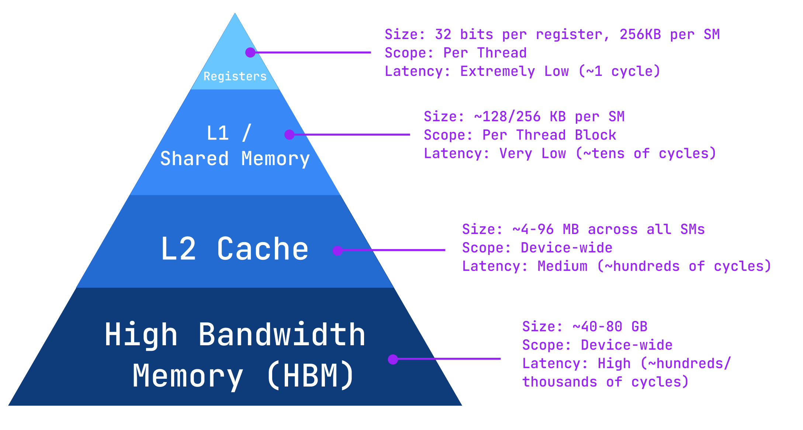
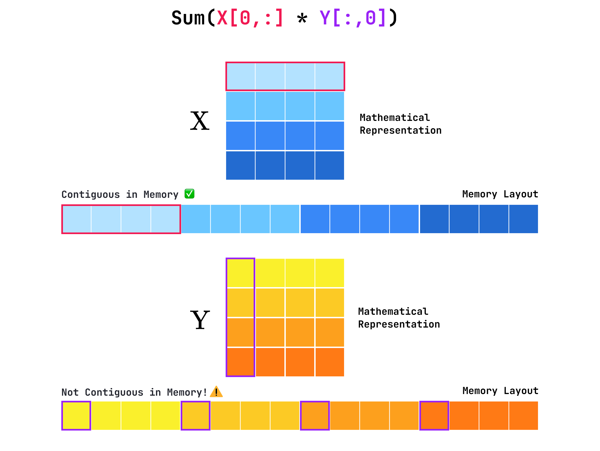
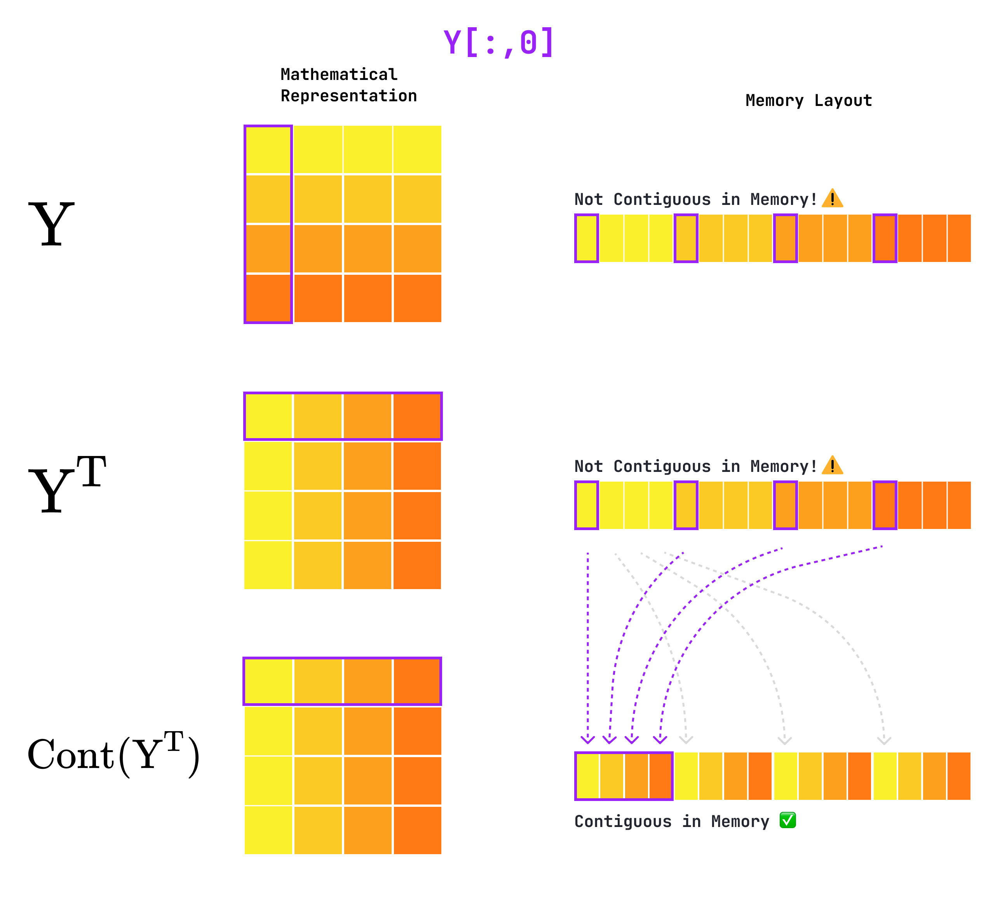

Matrix multiplication is undoubtedly the most common operation performed by GPUs. It is the fundamental building block of linear algebra and shows up across a wide spectrum of different fields such as graphics, physics simulations and scientific computing while being ubiquitous in machine learning.

In today's article, we'll break down the conceptual implementation of general matrix-matrix multiplication (GEMM) while introducing several optimisation concepts such as tiling and memory coalescing. Finally, we'll implement GEMM in Triton!

This article is the second of a series on Triton and GPU kernels. If you are not familiar with Triton or need a refresher on GPU basics, check out the [previous article](/articles/vector-addition) first.

_Disclaimer: all the following figures and animations were made by the author unless stated otherwise._

## Naive GEMM

Let's start simple: we want to multiply two matrices `X` and `Y` with shapes `(M,N)` and `(N,K)` respectively. The output matrix `Z=X@Y` will therefore have shape `(M,K)`.

This operation involves computing the dot products of all pairs of rows and columns in `X` and `Y` respectively. A straightforward NumPy implementation might look something like this:

```python
def naive_matmul(X: np.ndarray, Y: np.ndarray) -> np.ndarray:
    M, N = X.shape
    N_, K = Y.shape
    assert N == N_
    Z = np.zeros((M, K))

    for m in range(M):
        for k in range(K):
            Z[m, k] = np.dot(X[m, :], Y[:, k])

    return Z
```

While easy to write, read and understand, this implementation is highly inefficient in terms of memory access and caching. As mentioned in the first article of this series, a fundamental aspect of GPU optimisation is minimising data transfers.
However, our current implementation starts by loading a row from `X`, iteratively loads all `K` columns of `Y`, computes their dot product and repeats the process for every row in `X`. This results in a total of `M(K+1)` loading operations.

<video src="/media/articles/matmul/naive-matmul.mp4" autoplay muted loop playsinline preload="metadata" controls></video>
_Naive matrix multiplication — purple and blue tiles represent the vectors involved in dot products at every time step, green cells the computed output values._

As seen in the animation, the memory access pattern is wasteful, as every column of `Y` is loaded `M` times. As an analogy: this is like running to the grocery store (global memory) every time you need a new ingredient for a dish instead of preparing all the ingredients on your kitchen counter (shared memory). Ideally, we would like to minimise the number of times each chunk of data is loaded and maximise its reusability once loaded. This leaves us with two main axes of optimisation:

1. How can we improve the access pattern to minimise redundant loads?
2. How much data can we load at once, and where should it be stored on the GPU?

## Tiled GEMM

As mentioned previously, the naive approach to GEMM results in many redundant loads, which induces unnecessary overhead. Ideally, we'd like to load each segment of data only once and perform all the operations in which they are used before dropping them from memory.

An elegant approach to this problem is tiling, which involves dividing large matrices in smaller "tiles" or sub-matrices. Consider two matrices `X` and `Y` with shapes `(4,6)` and `(6,4)` respectively, `X@Y` results in a matrix `Z` with shape `(4,4)`.

In order to compute the first element of `Z`, `Z[0,0]`, we need to compute the dot product between the first row of `X` and the first column of `Y`: `Z[0,0] = dot(X[0, :], Y[:, 0])`. We can also break down the dot product into smaller chunks, for instance in groups of 3 elements: `Z[0,0] = dot(X[0,0:3], Y[0:3, 0]) + dot(X[0,3:6], Y[3:6, 0])`.
Alternatively, we can expand this approach to two dimensions and compute an entire `(2,2)` block of `Z` at a time: `Z[0:2, 0:2] = dot(X[0:2, 0:2], Y[0:2, 0:2]) + dot(X[0:2, 2:4], Y[2:4, 0:2]) + dot(X[0:2, 4:6], Y[4:6, 0:2])`.

Here's a visual representation of tiled matrix multiplication:

<video src="/media/articles/matmul/tiled-matmul.mp4" autoplay muted loop playsinline preload="metadata" controls></video>
_Tiled matrix multiplication. The computation is split into several "tiles" of X and Y (highlighted in pale blue and purple), each containing several blocks (dark blue and purple). In each block, we compute dot products (green cells in X and Y). These dot products are accumulated across the blocks of a tile to compute the output values in Z (the accumulation is represented by colors from orange to green)._

The animation illustrates how data is reused in tiled GEMM. For each 2×2 block in `X` and `Y`, we compute 4 dot products, which results in a `(2,2)` output matrix in `Z`. Since each tile contains 3 blocks, we need to accumulate 3 of these matrices to compute the final `(2,2)` output in `Z`. This accumulation is represented by colored cells in `Z`.

In the kitchen analogy, this is like fetching ingredients from the store and preparing them on the kitchen counter (i.e. small shared memory), reusing them several times before going back to the store.

Importantly, reusing loaded data over multiple steps allows this approach to drastically reduce the number of load operations. For `(2,2)` blocks, each `X` row and `Y` column is used in two dot products. Therefore, we're performing twice as many operations with each block of loaded data, roughly halving the number of load operations! Note that this generalises to larger blocks as well — using a `(32,32)` block would reduce the number of loads by a factor of around 32.

Now you're probably wondering "how large can these blocks be"? To answer this question, let's recall how memory is managed in modern GPUs.

## GPU Memory Hierarchy

We distinguish four main types of memory in Nvidia GPUs. Here, we take the example of an A100:

- **Registers:** The fastest and smallest type of memory on the GPU, residing directly within each Streaming Multiprocessor (SM). On the A100, each SM provides 256 KB of register file space (65,536 × 32-bit registers), distributed among its threads. Each thread gets its own private 32-bit registers for storing temporary variables and intermediate results, avoiding memory traffic altogether. However, register usage per thread directly affects occupancy, as using too many registers per thread limits how many threads can run concurrently.
- **L1/Shared Memory:** On an A100, each SM has 192KB of SRAM that can be flexibly configured as either a hardware-managed L1 cache or a programmer-managed shared memory. For performance-critical kernels like matrix multiplication, we explicitly use this space as shared memory to stage data tiles close to the compute units, bypassing the L1 cache entirely. This gives us fine-grained control over data reuse.
- **L2 cache:** This cache is slower than L1 but much larger, with around 40 MB shared across all SMs on the A100. It serves as a global cache for both data and instructions, reducing the number of accesses to high-latency HBM memory. The L2 cache is coherent across SMs, meaning that updates from one SM are visible to others, enabling synchronisation between thread blocks. Its bandwidth can reach several terabytes per second, acting as a buffer between the fast on-chip SRAM and the slower HBM.
- **High Bandwidth Memory (HBM):** This is the device memory — it has a capacity of either 40GB or 80GB depending on the A100 model. It provides extremely high bandwidth (up to 2 TB/s on the 80 GB variant) but with much higher latency than on-chip caches. HBM is where large tensors, model weights, and datasets reside during execution. Since accessing HBM is expensive, efficient kernels aim to minimise data movement and maximise on-chip data reuse via registers and shared memory.

As you can see, the memory hierarchy generally trades off capacity with latency. Therefore, maximising performance boils down to loading data from HBM into shared memory efficiently and reusing it as much as possible.


_GPU memory hierarchy, from fastest/smallest (top) to slowest/largest (bottom)._

Choosing our block size is critical. We want blocks to be large enough to create a lot of parallel work, but small enough that their data fits in the SM's shared memory and registers. A `BLOCK_SIZE` of 64 is a common starting point because it's a multiple of the warp size (32 threads), ensuring full hardware utilisation.

## Parallel Tiled GEMM

With these considerations in mind, a natural follow-up to our tiled GEMM is to parallelise the computation of each pair of tiles over several thread blocks, as depicted in the following animation.

<video src="/media/articles/matmul/parallel-tiled-matmul.mp4" autoplay muted loop playsinline preload="metadata" controls></video>
_Parallel tiled matrix multiplication. The iteration over tiles is replaced by a parallel operation over multiple thread blocks._

## Memory Coalescing

Before writing tiled GEMM in Triton, we need to consider one last detail: memory coalescing, a technique that allows optimal use of global memory bandwidth. Memory coalescing is achieved when subsequent threads in a warp access subsequent memory addresses. Imagine a librarian needing to fetch books for a client: if all books are side-by-side on a shelf, they can grab them all at once. In contrast, if all books are lying on different shelves, they'll have to grab them one by one, which takes significantly longer.

To understand how this applies to our case, note that matrices are stored linearly in memory — in other words, a `(2,2)` matrix is stored as a sequence of 4 consecutive elements. Frameworks like PyTorch adopt a row-major layout, meaning that elements of a matrix are per-row contiguous in memory. For instance, elements of our `(2,2)` matrix would be stored as follows: `[(0,0), (0,1), (1,0), (1,1)]` — notice that elements of the same row are contiguous (touching) while elements of the same column have a stride of 1 (separated by one element).


_PyTorch stores matrices in row-major layout. Elements of a row are contiguous in memory while elements of a column are strided._

This implies that we can load rows using coalesced loads, but columns do not satisfy this condition. However, we need to access columns of `Y` to compute dot products. In order to maximise performance, a good practice is to transpose `Y` so that we iterate on its rows rather than its columns.

However, transposing `Y` isn't enough to modify its layout in memory. As mentioned previously, PyTorch stores matrices in a flat array. Each matrix dimension is associated with a stride attribute, denoting the jump necessary to go from one element to the next along this dimension. For instance, a `(10,10)` matrix would have `strides=(10,1)`. Indeed, starting from element `[0,0]`, element `[1,0]` is 10 memory slots (i.e. one row) away, whereas element `[0,1]` is adjacent.

When transposing a tensor, PyTorch doesn't modify the layout in memory but simply recomputes the strides. In order to make the transpose effective from a memory standpoint, we need to call `Y.T.contiguous()`. These are the required steps to load columns of `Y` efficiently — however, we'll need to transpose the loaded blocks within the kernel to perform the dot product properly: `z_block = tl.dot(X_block, Y_block.T)`.


_Representation of `Y`, `Y.T` and `Y.T.contiguous()` in their block representation and memory layout. The transpose operation changes the behaviour of the matrix but doesn't modify its memory layout — this is why we need `.contiguous()` to enable coalesced reads on rows._

# Triton Implementation

From here on, we first describe the kernel without memory coalescing to simplify the logic and pointer arithmetic before summarising the changes required to make the load operations coalesced on `Y` columns.

### PyTorch Wrapper

Let's start by focusing on the PyTorch wrapper around the kernel. We need to read `M`, `N`, `K` from the input matrices and compute their strides since these constants will be useful later in the kernel. Then, we define the `BLOCK_SIZE` and declare the grid.

```python
import torch
import triton
import triton.language as tl

def block_matmul(X: torch.Tensor, Y: torch.Tensor) -> torch.Tensor:
    M, N = X.shape
    _, K = Y.shape

    Z = torch.empty((M, K), device="cuda")

    x_stride_m, x_stride_n = X.stride()
    y_stride_n, y_stride_k = Y.stride()
    z_stride_m, z_stride_k = Z.stride()

    BLOCK_SIZE = 64
    NUM_BLOCKS_M = triton.cdiv(M, BLOCK_SIZE)
    NUM_BLOCKS_K = triton.cdiv(K, BLOCK_SIZE)
    grid = (NUM_BLOCKS_M, NUM_BLOCKS_K)

    block_matmul_kernel[grid](
        X, x_stride_m, x_stride_n,
        Y, y_stride_n, y_stride_k,
        Z, z_stride_m, z_stride_k,
        M, N, K,
        BLOCK_SIZE
    )

    return Z
```

### Kernel Implementation

Now let's dive into the actual kernel code. We're going to make use of Triton's `make_block_ptr` utility, which simplifies the pointer arithmetic. We create one block pointer per matrix and pass the matrix shape, its strides, and the size of the block as inputs. Additionally, we specify the offset — the coordinate of the top-left element in the current block. For `X`, this corresponds to `(m_idx * BLOCK_SIZE, 0)` where `m_idx` is the index of the current block along the `M` dimension.

From there, we define `z_acc`, a zero matrix that will receive the partial dot-products as we iterate through tiles. We iterate through the shared dimension `N`, loading blocks of size `(BLOCK_SIZE, BLOCK_SIZE)`, and accumulate their dot products in `z_acc`. We then move the block pointers along the shared dimension using `.advance`.

You might have noticed that when loading data, we use `boundary_check` and `padding_option` instead of `mask` and `other` as in the previous article. These arguments are specific to the use of block pointers and specify which axes to check for out-of-bound operations (here `(0,1)` for `x` and `y`) and how to treat those invalid values — here we set them to zero to be ignored in the dot product.

```python
@triton.jit
def block_matmul_kernel(
        X_ptr, X_m_stride, X_n_stride,
        Y_ptr, Y_n_stride, Y_k_stride,
        Z_ptr, Z_m_stride, Z_k_stride,
        M, N, K, 
        BLOCK_SIZE: tl.constexpr,
    ):
    # --- Ensure pointers are cast to float32 ---
    X_ptr = X_ptr.to(tl.pointer_type(tl.float32))
    Y_ptr = Y_ptr.to(tl.pointer_type(tl.float32))
    Z_ptr = Z_ptr.to(tl.pointer_type(tl.float32))

    # --- Get Program IDs ---
    m_idx = tl.program_id(axis=0)
    k_idx = tl.program_id(axis=1)

    # --- Block pointers ---
    x_block_ptr = tl.make_block_ptr(
        base=X_ptr,  # pointer to first element of X
        shape=(M, N),  # shape of the base matrix
        strides=(X_m_stride, X_n_stride),
        # pointer to the top-left element of the current block
        offsets=(m_idx * BLOCK_SIZE, 0),
        block_shape=(BLOCK_SIZE, BLOCK_SIZE),  # shape of the block
        order=(0, 1),  # row-major layout
    )
    y_block_ptr = tl.make_block_ptr(
        base=Y_ptr,
        shape=(N, K),
        strides=(Y_n_stride, Y_k_stride),
        offsets=(0, k_idx * BLOCK_SIZE),
        block_shape=(BLOCK_SIZE, BLOCK_SIZE),
        order=(0,1),
    )
    z_block_ptr = tl.make_block_ptr(
        base=Z_ptr,
        shape=(M, K),
        strides=(Z_m_stride, Z_k_stride),
        offsets=(m_idx * BLOCK_SIZE, k_idx * BLOCK_SIZE),
        block_shape=(BLOCK_SIZE, BLOCK_SIZE),
        order=(0,1),
    )

    # --- Tiled GEMM loop ---
    z_acc = tl.zeros((BLOCK_SIZE, BLOCK_SIZE), dtype=tl.float32) # accumulator
    for _ in range(0, N, BLOCK_SIZE):
        x = tl.load(x_block_ptr, boundary_check=(0,1), padding_option="zero")
        y = tl.load(y_block_ptr, boundary_check=(0,1), padding_option="zero")
        z_acc += tl.dot(x, y)

        x_block_ptr = x_block_ptr.advance((0, BLOCK_SIZE))
        y_block_ptr = y_block_ptr.advance((BLOCK_SIZE, 0))

    tl.store(pointer=z_block_ptr, value=z_acc, boundary_check=(0,1))
```

### Benchmark

We can now take a look at the performance of this kernel by using the following function:

```python
def bench(fn: callable, x: torch.Tensor, y: torch.Tensor, repeat: int):
  flops = []
  med_latency = []

  for _ in tqdm(range(repeat), desc=f"Benchmarking {fn.__name__}"):
    latency_ms = triton.testing.do_bench(
      lambda: fn(x, y),
      quantiles=[0.5], # get the median latency
      return_mode="all",
      )
    n_flops = 2 * M * N * K # matmul roughly requires 2*M*N*K operations
    tflops = n_flops / (latency_ms / 1e3) / 1e12

    med_latency.append(latency_ms)
    flops.append(tflops)

  flops = np.array(flops)
  med_latency = np.array(med_latency)
  print(f"Absolute Error: {torch.sum(torch.abs(X@Y - fn(x, y)))}")
  print(f"Median Latency: {med_latency.mean():.4f} ± {med_latency.std():.3f} ms")
  print(f"Throughput: {flops.mean():.4f} ± {flops.std():.3f} TeraFLOPS")

M = 8192
N = 6144
K = 4096

X = torch.randn((M, N), device="cuda", dtype=torch.float32)
Y = torch.randn((N, K), device="cuda", dtype=torch.float32)

bench(block_matmul, X, Y, repeat=10)
```

We get the following outputs (using a T4 GPU on Colab):

```text
Absolute Error: 0.0 # the kernel outputs the correct result!
Median Latency: 130.7831 ± 1.794 ms
Throughput: 3.1533 ± 0.043 TeraFLOPS
```

### Coalesced Loads for Y

Now let's review the changes required for coalesced loads on `Y`: we mainly need to flip the shape, strides and offsets when defining the block pointer for `Y`. Additionally, we update the block pointer to move along the column dimension (previously row dimension).

```python
@triton.jit
def coalesced_block_matmul_kernel(
    X_ptr, X_m_stride, X_n_stride,
    Y_ptr, Y_k_stride, Y_n_stride,
    Z_ptr, Z_m_stride, Z_k_stride,
    M, N, K,
    BLOCK_SIZE: tl.constexpr,
):
    ...
    y_block_ptr = tl.make_block_ptr(
        base=Y_ptr,
        # flip the shape, strides and offsets to match Y.T
        shape=(K, N),
        strides=(Y_k_stride, Y_n_stride),
        offsets=(k_idx * BLOCK_SIZE, 0),
        block_shape=(BLOCK_SIZE, BLOCK_SIZE),
        order=(0, 1),
    )
    ...

    for _ in range(0, N, BLOCK_SIZE):
        ... # loads
        z_acc += tl.dot(x, y.T)  # transpose Y back for dot product
        x_block_ptr = tl.advance(x_block_ptr, offsets=(0, BLOCK_SIZE))
        # advance the block pointer along columns of Y.T (i.e rows of Y)
        y_block_ptr = tl.advance(y_block_ptr, offsets=(0, BLOCK_SIZE))

    tl.store(pointer=z_block_ptr, value=z_acc, boundary_check=(0, 1))

def coalesced_block_matmul(X, Y):
    Y = Y.T.contiguous()  # Y is now (K,N)
    M, N = X.shape
    K, _ = Y.shape
    Z = torch.empty((M, K), device="cuda")

    x_stride_m, x_stride_n = X.stride()
    y_stride_k, y_stride_n = Y.stride()
    z_stride_m, z_stride_k = Z.stride()

    ...  # define BLOCK_SIZE and grid

    coalesced_block_matmul_kernel[grid](
        X, x_stride_m, x_stride_n,
        Y, y_stride_k, y_stride_n,
        Z, z_stride_m, z_stride_k,
        M, N, K,
        BLOCK_SIZE,
    )

    return Z
```

Here are the results of our benchmark for the kernel with coalesced loads for `Y`:

```text
Absolute Error: 0.0 # Again, the kernel is correct!
Median Latency: 261.9420 ± 0.858 ms
Throughput: 1.5741 ± 0.005 TeraFLOPS
```

Surprisingly, the throughput of this second kernel is only half of what we obtained with the first one, despite improving the efficiency of load operations 🤔

A quick inspection using Nsight (Nvidia's kernel profiler, more on that in a future article) reveals that the transpose operation within the kernel creates a "traffic jam". Specifically, the transpose creates bank conflicts, causing threads to remain idle most of the time. Notably, the warp scheduler has no eligible warp to dispatch 87.6% of the time, as they are waiting for the bank conflict to resolve. Additionally, the report reads:

**Coalesced kernel (`Y.T.contiguous()`):**

```text
----------------------- ----------- --------------
Metric Name             Metric Unit   Metric Value
----------------------- ----------- --------------
...
DRAM Throughput                   %           8.20
Compute (SM) Throughput           %          21.14
...
```

This indicates that the kernel is latency bound (i.e. neither memory nor compute bound — refer to the previous article for more details). In contrast, the first kernel is compute bound (i.e. increasing compute will improve performance), since its compute throughput is high compared to its DRAM throughput:

**Original kernel (no coalescing):**

```text
----------------------- ----------- --------------
Metric Name             Metric Unit   Metric Value
----------------------- ----------- --------------
...
DRAM Throughput                   %          29.35
Compute (SM) Throughput           %          74.39
...
```

## Conclusion

This experiment highlights the importance of profiling and empirical validation. Even well-intentioned optimisations like coalescing memory accesses can introduce new bottlenecks if not evaluated carefully. The first kernel, though simpler, was compute-bound and better matched the hardware characteristics.

In the next articles of this series, we'll implement a softmax kernel, paying particular attention to integrating Triton with PyTorch's `autograd` and profiling kernels using Nsight.

Until next time! 👋

## Useful Resources

- Complete implementation
- Introduction to GEMM and Assignment
- Nvidia Ampere Architecture (A100 specs)
