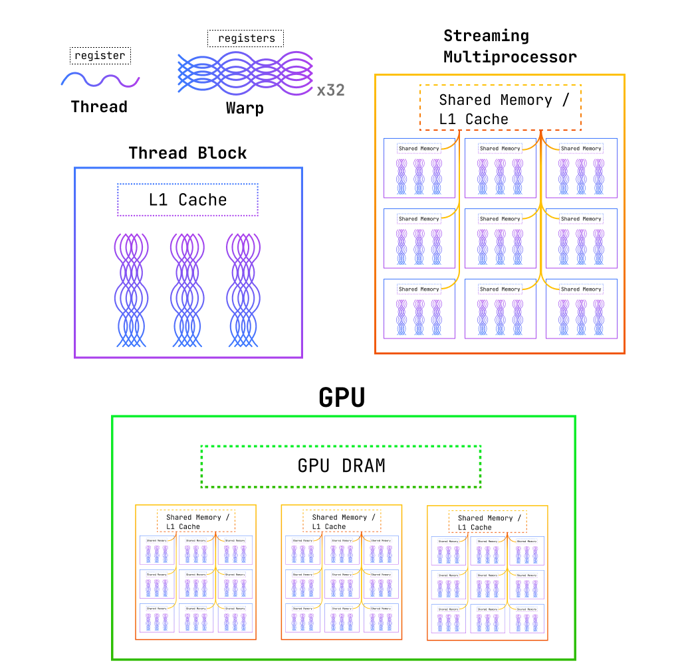
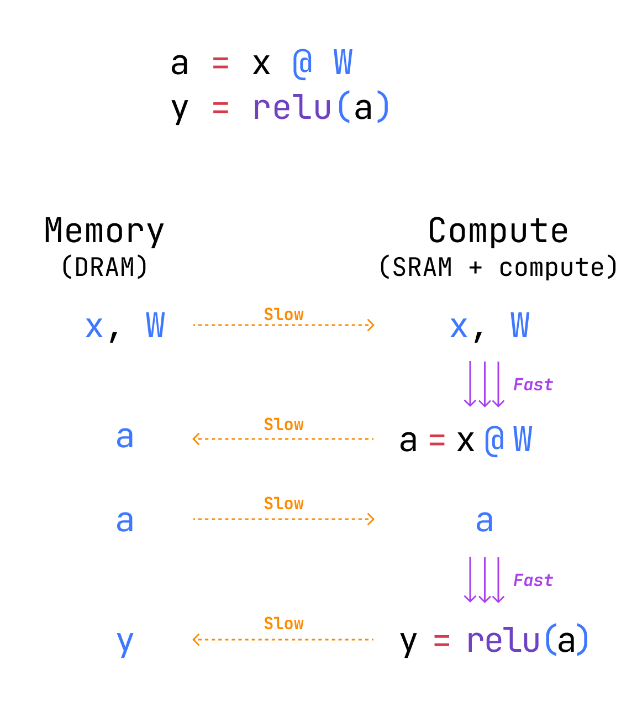
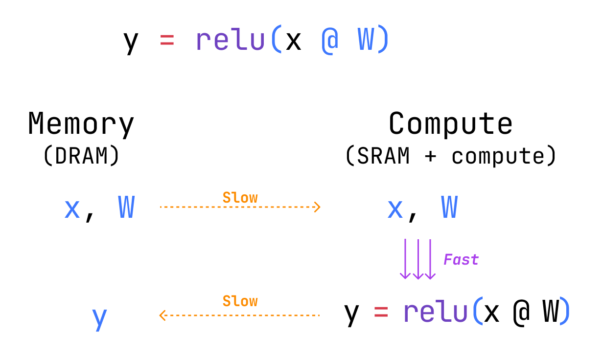
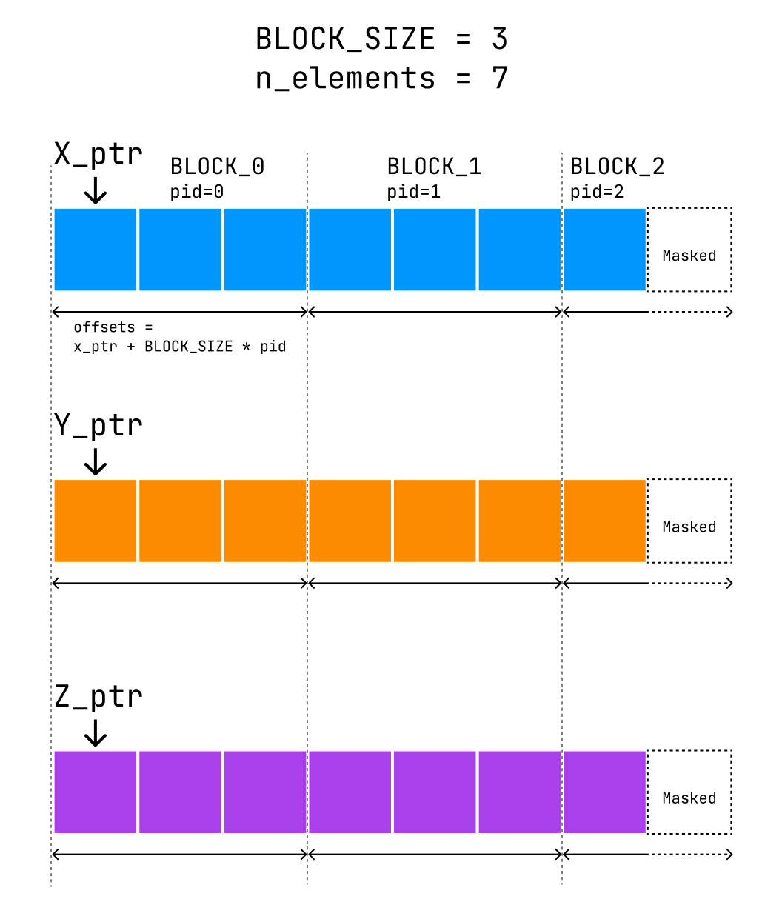

In the era of billion-parameter models, a little optimisation goes a long way. Models like **GPT4** cost **more than \$100 millions to train**, which makes a **1% efficiency gain** **worth _over a million dollars_**. A powerful way to optimise the efficiency of machine learning models is by writing some of their components **directly on the GPU**. Now if you're anything like me, the simple mention of CUDA kernels is enough to send chills down your spine, as they are notoriously complex to write and debug.
Fortunately, **OpenAI** released **Triton** in 2021, a new language and compiler abstracting away much of CUDA's complexity and allowing less experienced practitioners to write performant kernels. A notable example is **Unsloth**, an LLM-training service that promises **30x faster training** with **60% less memory usage**, all thanks to **replacing layers written in PyTorch with Triton kernels**.
In this tutorial series, we'll learn the basics of GPU architecture and how to implement high-performance Triton kernels!

## GPU Architecture Basics

In this section, we'll go through the very basics of (_Nvidia_) GPUs to get us started and write our first Triton kernel by the end of this article.
Starting from the smallest software unit, we can describe the hierarchy of execution units as follows:
- **Threads**: The smallest **unit of work**, they run the user-defined kernel code.
- **Warps**: The smallest **scheduling unit**, they are always composed of 32 parallel threads, each with their own instruction address counter and register state. Threads in a warp **start together** but are **free to branch** and **execute independently**.
- **Thread Blocks**: Group of warps, where all threads can **cooperate via shared memory** and sync barriers. It is required that thread blocks can execute **independently** and in any order, in parallel or sequentially. This independence allows thread blocks to be **scheduled in any order across any number of cores**, so that GPU programs scale efficiently with the number of cores. We can synchronise the threads within a block at specific points in the kernel if needed, for example to synchronise memory access.
- **Streaming Multiprocessor (SM)**: A unit in charge of **executing many warps in parallel**, it owns shared memory and an L1 cache (holds the most recent global-memory lines that the SM has accessed). An SM has a dedicated **warp scheduler** that pull warps from the thread blocks that are ready to run.

On the hardware side, the smallest unit of work is a **CUDA core**, the physical **Arithmetic Logic Unit** (ALU) which performs **arithmetic operations for a thread** (or parts of it)[^cuda-cores].

[^cuda-cores]: Modern Nvidia GPUs also ship dedicated Tensor Cores, separate from CUDA cores, specialised for the matrix-multiply-accumulate operations that dominate deep learning workloads. We'll lean on this distinction when we get to tiled matrix multiplication.

To summarise this section with an analogy, we could see **CUDA cores** as **individual workers**, while a **warp** is a **squad of 32 workers** given the same instruction at once. They may or may not execute this task the same way (branching) and can potentially complete it at a different point in time (independence). A **thread block** is composed of **several squads sharing a common workspace** (i.e. have shared memory), workers from all squads in the workspace can wait for each other to get lunch at the same time. A **streaming multiprocessor** is a **factory floor with many squads working together and sharing tools and storage**. Finally, the **GPU** is a **whole plant**, with many floors.



## Optimisation Basics

When optimising deep learning models, we are juggling with three main components:
1. **Compute**: Time spent by the GPU computing floating point operations (FLOPS).
2. **Memory**: Time spent transferring tensors within a GPU.
3. **Overhead**: All other operations (Python interpreter, PyTorch dispatch, …).

Keeping those components in mind helps figuring out the right way to resolve a bottleneck. For instance, increasing compute (e.g. using a more powerful GPU) doesn't help if most of the time is spent doing memory transfers. Ideally though, most of the time should be spent on compute, more precisely on matrix multiplications, the precise operation GPUs are optimised for.
This implies minimising the cost paid to move data around, either from the CPU to the GPU ("**data transfer cost**"), from one node to the other ("**network cost**") or from CUDA global memory (**DRAM**, cheap but slow) to CUDA shared memory (**SRAM**, expensive but fastest on-device memory). The later is called **bandwidth costs** and is going to be our main focus for now. Common strategies to reduce bandwidth costs include:
1. **Reusing** data loaded in shared memory for multiple steps. A prime example of this is tiled matrix multiplication, which we'll cover in a future post.
2. **Fusing** multiple operations in a single kernel (since every kernel launch implies moving data from DRAM to SRAM), for instance we can fuse a matrix multiplication with an activation function. Generally, **operator fusion** can provide massive performance increase since it prevents a lot of global memory reads/writes and any two operators present an opportunity for fusion.



In this example, we perform a matrix multiplication `x @ W` and store the result in an intermediate variable `a`. We then apply a `relu` to `a` and store the result in a variable `y`. This requires the GPU to read from `x` and `W` in global memory, write the result in `a`, read from `a` again and finally write in `y`. Instead, operator fusion would allow us to halve the amount of reads and writes to global memory by performing the matrix multiplication and applying the ReLU in a single kernel.



## Triton

We'll now write our first Triton kernel, a simple vector addition. First, let's walk through how this operation is broken down and executed on a GPU.

Consider wanting to sum the entries of two vectors `X` and `Y`, each with 7 elements (`n_elements=7`).
We'll instruct the GPU to tackle this problem in chunks of 3 elements at a time (`BLOCK_SIZE=3`). Therefore, to cover all 7 elements of the input vectors, the GPU will launch 3 parallel "programs", independent instance of our kernel, each with a unique program ID, `pid`:
- Program 0 is assigned elements `0, 1, 2`.
- Program 1 is assigned elements `3, 4, 5`.
- Program 2 is assigned element `6`.

Then, these programs will write back the results in a vector `Z` stored in global memory.
An important detail is that a kernel doesn't receive an entire vector `X`, instead it receives a **pointer to the memory address of the first element**, `X[0]`. In order to access the actual values of `X`, we need to load them from global memory manually.
We can access the data for each block by using the program ID: `block_start = pid * BLOCK_SIZE`. From there, we can get the remaining element addresses for that block by computing `offsets = block_start + range(0, BLOCK_SIZE)` and load them into memory.
However, remember that program 2 is only assigned element 6, but its offsets are `[6, 7, 8]`. To avoid any indexing error, Triton lets us define a **mask** to identify valid target elements, here `mask = offsets < n_elements`.
We can now safely load `X` and `Y` and add them together before writing the result back to global memory in a similar way.



Let's take a closer look at the code, here's the Triton kernel:

```python
@triton.jit
def add_kernel(
	x_ptr, # pointer to the first memory entry of x
	y_ptr, # pointer to the first memory entry of y
	output_ptr, # pointer to the first memory entry of the output
	n_elements, # dimension of x and y
	BLOCK_SIZE: tl.constexpr, # size of a single block
):
	# --- Compute offsets and mask ---
	pid = tl.program_id(axis=0) # block index
	block_start = pid * BLOCK_SIZE # start index for current block
	offsets = block_start + tl.arange(0, BLOCK_SIZE) # index range
	mask = offsets < n_elements # mask out-of-bound elements

	# --- Load variables from global memory ---
	x = tl.load(x_ptr + offsets, mask=mask)
	y = tl.load(y_ptr + offsets, mask=mask)

	# --- Operation ---
	output = x + y

	# --- Save results to global memory ---
	tl.store(pointer=output_ptr + offsets, value=output, mask=mask)
```

Let's break down some of the Triton-specific syntax:

- First, a Triton kernel is always decorated by `@triton.jit`, meaning that the kernel will be just-in-time (*jit*) compiled.
- Second, some arguments need to be declared as static, meaning that they are known at compute-time. This is required for `BLOCK_SIZE` and is achieved by add the `tl.constexpr` type annotation. Also note that we do not annotate other variables, since they are not proper Python variables.
- We use `tl.program_id` to access the ID of the current block, `tl.arange` behaves similarly to Numpy's `np.arange`.
- Loading and storing variables is achieved by calling `tl.load` and `tl.store` with arrays of pointers. Notice that there is no `return` statement, this role is delegated to `tl.store`.

To use our kernel, we now need to write a **PyTorch-level wrapper** that provides memory pointers and defines a **kernel grid**. Generally, the kernel grid is a 1D, 2D or 3D tuple containing the **number of thread blocks allocated to the kernel along each axis**. In our previous example, we used a 1D grid of 3 thread blocks: `grid = (3, )`.
To handle varying array sizes, we default to `grid = (ceil(n_elements / BLOCK_SIZE), )`.

```python
def add(X: torch.Tensor, Y: torch.Tensor) -> torch.Tensor:
	"""PyTorch wrapper for `add_kernel`."""
	output = torch.zeros_like(x) # allocate memory for the output
	n_elements = output.numel()  # dimension of X and Y

	# cdiv = ceil div, computes the number of blocks to use
	grid = lambda meta: (triton.cdiv(n_elements, meta["BLOCK_SIZE"]),)
	# calling the kernel will automatically store `BLOCK_SIZE` in `meta`
	# and update `output`
	add_kernel[grid](X, Y, output, n_elements, BLOCK_SIZE=1024)

	return output
```

Here are two final notes about the wrapper:
1. You might have noticed that `grid` is defined as a *lambda function*. This allows Triton to compute the number of thread blocks to launch **at launch time**. Therefore, we compute the grid size based on the block size which is stored in `meta`, a dictionary of compile-time constants that are exposed to the kernel.
2. When calling the kernel, the value of `output` will be modified in-place, so we don't need to reassign `output = add_kernel[…]`.

We can conclude this tutorial by verifying that our kernel works properly:

```python
x, y = torch.randn((2, 2048), device="cuda")

print(add(x, y))
>> tensor([ 1.8022, 0.6780, 2.8261, ..., 1.5445, 0.2563, -0.1846], device='cuda:0')

abs_difference = torch.abs((x + y) - add(x, y))
print(f"Max absolute difference: {torch.max(abs_difference)}")
>> Max absolute difference: 0.0
```

That's it for this introduction, in following posts we'll learn to implement more interesting kernels such as tiled matrix multiplication and see how to integrate Triton kernels in ML models using PyTorch's `autograd`.
Until next time! 👋

---
## References
- [Cost of training GPT4](https://en.wikipedia.org/wiki/GPT-4#:~:text=Sam%20Altman%20stated%20that%20the,51)
- [Unsloth kernels](https://unsloth.ai/introducing)
- [Triton tutorial: Vector Addition](https://triton-lang.org/main/getting-started/tutorials/01-vector-add.html#sphx-glr-getting-started-tutorials-01-vector-add-py)
- [Making Deep Learning Go Brrrr From First Principles](https://horace.io/brrr_intro.html)
